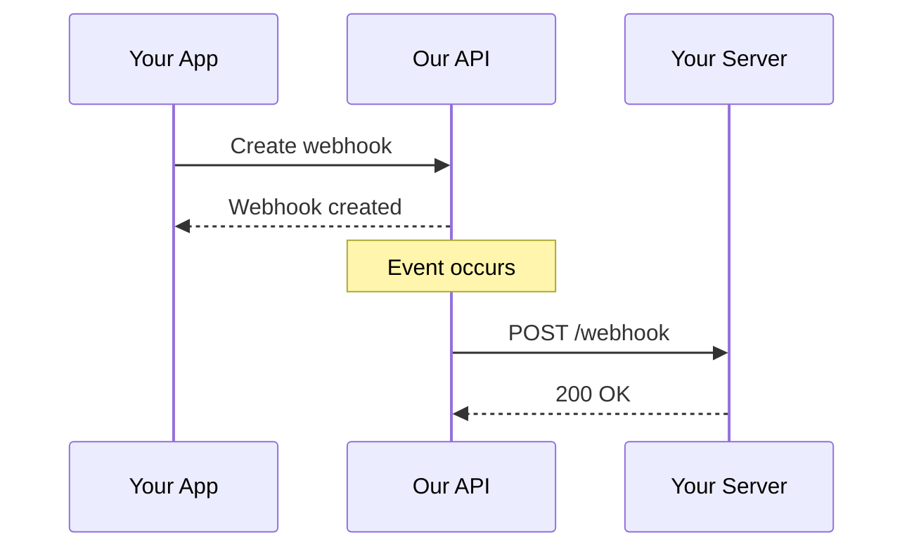

# Webhooks

Webhooks allow you to receive real-time notifications when events occur in your account.

## Overview

Instead of polling the API for changes, webhooks push data to your server when events happen, making your integration more efficient and responsive.

## How Webhooks Work



## Creating a Webhook

### Endpoint

```http
POST /webhooks
```

### Request Body

```json
{
  "url": "https://yourdomain.com/webhooks",
  "events": ["user.created", "user.updated", "project.created"],
  "secret": "your_webhook_secret"
}
```

### Example

=== cURL
```bash
curl -X POST "https://api.example.com/v1/webhooks" \
  -H "Authorization: Bearer YOUR_API_KEY" \
  -H "Content-Type: application/json" \
  -d '{
    "url": "https://yourdomain.com/webhooks",
    "events": ["user.created", "user.updated"]
  }'
```
===

=== JavaScript
```javascript
const response = await fetch('https://api.example.com/v1/webhooks', {
  method: 'POST',
  headers: {
    'Authorization': 'Bearer YOUR_API_KEY',
    'Content-Type': 'application/json'
  },
  body: JSON.stringify({
    url: 'https://yourdomain.com/webhooks',
    events: ['user.created', 'user.updated']
  })
});
```
===

=== Python
```python
import requests

response = requests.post(
    'https://api.example.com/v1/webhooks',
    headers={'Authorization': 'Bearer YOUR_API_KEY'},
    json={
        'url': 'https://yourdomain.com/webhooks',
        'events': ['user.created', 'user.updated']
    }
)
```
===

### Response

```json
{
  "id": "wh_123456",
  "url": "https://yourdomain.com/webhooks",
  "events": ["user.created", "user.updated"],
  "created_at": "2023-12-01T10:00:00Z",
  "status": "active"
}
```

## Available Events

### User Events

Event | Description
--- | ---
`user.created` | A new user was created
`user.updated` | A user was updated
`user.deleted` | A user was deleted

### Project Events

Event | Description
--- | ---
`project.created` | A new project was created
`project.updated` | A project was updated
`project.deleted` | A project was deleted

### Team Events

Event | Description
--- | ---
`team.member.added` | A member was added to a team
`team.member.removed` | A member was removed from a team
`team.member.role_changed` | A member's role was changed

## Webhook Payload

Each webhook delivery includes:

### Headers

```http
POST /webhooks HTTP/1.1
Host: yourdomain.com
Content-Type: application/json
X-Webhook-Id: wh_123456
X-Webhook-Event: user.created
X-Webhook-Signature: sha256=...
User-Agent: ExampleAPI-Webhooks/1.0
```

### Body

```json
{
  "id": "evt_abc123",
  "type": "user.created",
  "created_at": "2023-12-01T15:30:00Z",
  "data": {
    "id": "usr_789",
    "name": "John Doe",
    "email": "john@example.com",
    "created_at": "2023-12-01T15:30:00Z"
  }
}
```

## Securing Webhooks

### Signature Verification

Verify webhook authenticity using the signature:

=== Node.js
```javascript
const crypto = require('crypto');

function verifyWebhookSignature(payload, signature, secret) {
  const hmac = crypto.createHmac('sha256', secret);
  const digest = 'sha256=' + hmac.update(payload).digest('hex');
  return crypto.timingSafeEqual(
    Buffer.from(signature),
    Buffer.from(digest)
  );
}

// Express.js example
app.post('/webhooks', (req, res) => {
  const signature = req.headers['x-webhook-signature'];
  const payload = JSON.stringify(req.body);
  
  if (!verifyWebhookSignature(payload, signature, WEBHOOK_SECRET)) {
    return res.status(401).send('Invalid signature');
  }
  
  // Process webhook
  res.status(200).send('OK');
});
```
===

=== Python
```python
import hmac
import hashlib

def verify_webhook_signature(payload, signature, secret):
    expected_signature = 'sha256=' + hmac.new(
        secret.encode(),
        payload.encode(),
        hashlib.sha256
    ).hexdigest()
    
    return hmac.compare_digest(signature, expected_signature)

# Flask example
@app.route('/webhooks', methods=['POST'])
def webhook():
    signature = request.headers.get('X-Webhook-Signature')
    payload = request.data.decode()
    
    if not verify_webhook_signature(payload, signature, WEBHOOK_SECRET):
        return 'Invalid signature', 401
    
    # Process webhook
    return 'OK', 200
```
===

=== Go
```go
package main

import (
    "crypto/hmac"
    "crypto/sha256"
    "encoding/hex"
    "io/ioutil"
    "net/http"
)

func verifyWebhookSignature(payload []byte, signature, secret string) bool {
    mac := hmac.New(sha256.New, []byte(secret))
    mac.Write(payload)
    expectedSignature := "sha256=" + hex.EncodeToString(mac.Sum(nil))
    return hmac.Equal([]byte(signature), []byte(expectedSignature))
}

func webhookHandler(w http.ResponseWriter, r *http.Request) {
    payload, _ := ioutil.ReadAll(r.Body)
    signature := r.Header.Get("X-Webhook-Signature")
    
    if !verifyWebhookSignature(payload, signature, webhookSecret) {
        http.Error(w, "Invalid signature", http.StatusUnauthorized)
        return
    }
    
    // Process webhook
    w.WriteHeader(http.StatusOK)
}
```
===

## Handling Webhooks

### Best Practices

!!! Success Webhook Best Practices
1. **Respond quickly** - Return 200 OK immediately
2. **Process async** - Queue events for background processing
3. **Be idempotent** - Handle duplicate deliveries gracefully
4. **Verify signatures** - Always verify the webhook signature
5. **Handle failures** - Implement proper error handling
6. **Log events** - Keep audit logs of webhook deliveries
!!!

### Example Handler

=== Node.js
```javascript
const express = require('express');
const queue = require('./queue'); // Your queue implementation

const app = express();
app.use(express.json());

app.post('/webhooks', async (req, res) => {
  try {
    // Verify signature
    const signature = req.headers['x-webhook-signature'];
    if (!verifySignature(req.body, signature)) {
      return res.status(401).send('Invalid signature');
    }
    
    // Acknowledge receipt immediately
    res.status(200).send('OK');
    
    // Process asynchronously
    await queue.add('webhook', req.body);
    
  } catch (error) {
    console.error('Webhook error:', error);
    res.status(500).send('Error processing webhook');
  }
});

app.listen(3000);
```
===

=== Python
```python
from flask import Flask, request
from celery import Celery

app = Flask(__name__)
celery = Celery('tasks')

@celery.task
def process_webhook(data):
    """Process webhook asynchronously"""
    event_type = data['type']
    
    if event_type == 'user.created':
        # Handle user creation
        pass
    elif event_type == 'user.updated':
        # Handle user update
        pass

@app.route('/webhooks', methods=['POST'])
def webhook():
    # Verify signature
    signature = request.headers.get('X-Webhook-Signature')
    if not verify_signature(request.data, signature):
        return 'Invalid signature', 401
    
    # Queue for processing
    process_webhook.delay(request.json)
    
    return 'OK', 200
```
===

## Retry Logic

If your endpoint doesn't respond with a `2xx` status code, we'll retry the delivery:

Attempt | Delay
--- | ---
1 | Immediate
2 | 1 minute
3 | 5 minutes
4 | 30 minutes
5 | 1 hour
6 | 6 hours

After 6 failed attempts, the webhook delivery is marked as failed.

## Managing Webhooks

### List Webhooks

```http
GET /webhooks
```

**Response:**

```json
{
  "data": [
    {
      "id": "wh_123456",
      "url": "https://yourdomain.com/webhooks",
      "events": ["user.created", "user.updated"],
      "status": "active",
      "created_at": "2023-12-01T10:00:00Z"
    }
  ]
}
```

### Get Webhook

```http
GET /webhooks/{id}
```

### Update Webhook

```http
PATCH /webhooks/{id}
```

**Request Body:**

```json
{
  "events": ["user.created", "user.updated", "user.deleted"],
  "status": "active"
}
```

### Delete Webhook

```http
DELETE /webhooks/{id}
```

**Response:** `204 No Content`

## Testing Webhooks

### Send Test Event

Trigger a test webhook delivery:

```http
POST /webhooks/{id}/test
```

**Response:**

```json
{
  "id": "evt_test_123",
  "status": "delivered",
  "response_code": 200,
  "response_body": "OK"
}
```

### Local Testing

Use tools like [ngrok](https://ngrok.com) to expose your local server:

```bash
# Start ngrok
ngrok http 3000

# Use the ngrok URL for your webhook
https://abc123.ngrok.io/webhooks
```

## Webhook Logs

View delivery history for debugging:

```http
GET /webhooks/{id}/deliveries
```

**Response:**

```json
{
  "data": [
    {
      "id": "del_789",
      "event_id": "evt_abc123",
      "status": "delivered",
      "response_code": 200,
      "response_time_ms": 145,
      "created_at": "2023-12-01T15:30:00Z"
    }
  ]
}
```

## Troubleshooting

### Common Issues

#### Webhook Not Receiving Events

1. Check webhook status is `active`
2. Verify the URL is publicly accessible
3. Ensure your server responds with `200 OK`
4. Check firewall/security settings

#### Signature Verification Fails

1. Use raw request body for verification
2. Check secret is correct
3. Verify signature header name
4. Ensure consistent encoding (UTF-8)

#### Duplicate Events

Webhooks may be delivered multiple times. Use the event `id` to detect and ignore duplicates:

```javascript
const processedEvents = new Set();

function handleWebhook(event) {
  if (processedEvents.has(event.id)) {
    return; // Already processed
  }
  
  processedEvents.add(event.id);
  // Process event
}
```

## Example Implementations

### Complete Example

=== Node.js + Express
```javascript
const express = require('express');
const crypto = require('crypto');

const app = express();
app.use(express.json());

const WEBHOOK_SECRET = process.env.WEBHOOK_SECRET;
const processedEvents = new Set();

function verifySignature(body, signature) {
  const hmac = crypto.createHmac('sha256', WEBHOOK_SECRET);
  const digest = 'sha256=' + hmac.update(JSON.stringify(body)).digest('hex');
  return crypto.timingSafeEqual(Buffer.from(signature), Buffer.from(digest));
}

app.post('/webhooks', (req, res) => {
  const signature = req.headers['x-webhook-signature'];
  
  if (!verifySignature(req.body, signature)) {
    return res.status(401).send('Invalid signature');
  }
  
  const event = req.body;
  
  // Prevent duplicate processing
  if (processedEvents.has(event.id)) {
    return res.status(200).send('Already processed');
  }
  
  processedEvents.add(event.id);
  
  // Handle different event types
  switch (event.type) {
    case 'user.created':
      console.log('New user:', event.data.name);
      break;
    case 'user.updated':
      console.log('Updated user:', event.data.name);
      break;
    case 'project.created':
      console.log('New project:', event.data.name);
      break;
  }
  
  res.status(200).send('OK');
});

app.listen(3000, () => {
  console.log('Webhook server listening on port 3000');
});
```
===

## Resources

- [API Reference](rest-api.md)
- [Authentication](authentication.md)
- [Webhook Best Practices](https://webhooks.fyi)

---

That's everything you need to know about webhooks! Check the [REST API](rest-api.md) for more endpoints.
