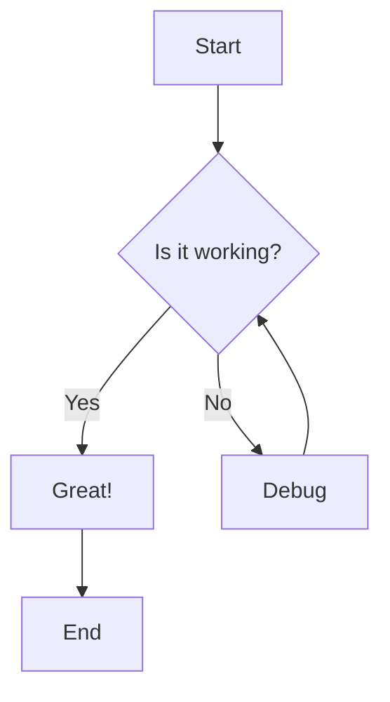

# Retype Components Demo

Explore the rich set of components available in Retype to enhance your documentation.

## Alerts

Alerts are great for highlighting important information.

!!! Info
This is an info alert. Use it for general information.
!!!

!!! Success
This is a success alert. Perfect for positive confirmations!
!!!

!!! Warning
This is a warning alert. Use it to grab attention.
!!!

!!! Danger
This is a danger alert. Use it for critical information.
!!!

!!! Note
This is a note alert. Great for side notes and tips.
!!!

## Tabs

=== Tab 1
Content for the first tab goes here.

You can include any Markdown content:
- Lists
- Code blocks
- Images
===

=== Tab 2
Content for the second tab.

```javascript
console.log("Code works in tabs too!");
```
===

=== Tab 3
And here's the third tab with more content.
===

## Code Blocks

### JavaScript Example

```javascript
function greet(name) {
  console.log(`Hello, ${name}!`);
}

greet("World");
```

### Python Example

```python
def fibonacci(n):
    if n <= 1:
        return n
    return fibonacci(n-1) + fibonacci(n-2)

print(fibonacci(10))
```

### Bash Example

```bash
#!/bin/bash
echo "Hello from Bash!"
ls -la
```

### With Line Numbers

```js #
// This code block has line numbers
const numbers = [1, 2, 3, 4, 5];
const doubled = numbers.map(n => n * 2);
console.log(doubled); // [2, 4, 6, 8, 10]
```

## Panels

+++ Panel Title
This is content inside a panel. Panels are collapsible sections that help organize content.

You can include:
- Lists
- Code blocks
- Images
- Any other Markdown content
+++

+++ Open by Default
:icon-check-circle: This panel is open by default.

Add `open` to keep a panel expanded.
+++

## Tables

### Basic Table

Name | Language | Stars
--- | --- | ---
Retype | TypeScript | 1000+
Jekyll | Ruby | 45k+
Hugo | Go | 65k+

### Aligned Table

| Left Aligned | Center Aligned | Right Aligned |
| :--- | :---: | ---: |
| Text | Text | Text |
| More | More | More |

## Lists

### Unordered List

- First item
- Second item
  - Nested item 1
  - Nested item 2
- Third item

### Ordered List

1. First step
2. Second step
   1. Sub-step A
   2. Sub-step B
3. Third step

### Task List

- [x] Completed task
- [x] Another completed task
- [ ] Pending task
- [ ] Another pending task

## Links

### Internal Links

- [Home](/)
- [Getting Started](/getting-started/)
- [API Reference](/api/)

### External Links

- [Retype Official Site](https://retype.com)
- [GitHub Repository](https://github.com/retypeapp/retype)

## Images

### Basic Image


### Image with Caption


*A beautiful landscape captured at sunset*

## Blockquotes

> "Documentation is a love letter that you write to your future self."
> — Damian Conway

> This is a simple blockquote.
> It can span multiple lines.

## Badges

!!!success Badge Support
Retype supports inline badges and labels to highlight important information.
!!!

Use inline code formatting for simple badges: `v1.0.0` `beta` `new`

## Horizontal Rules

---

The line above is a horizontal rule, created with three dashes.

***

This one uses three asterisks.

## Formatting

### Text Formatting

- **Bold text**
- *Italic text*
- ***Bold and italic***
- ~~Strikethrough~~
- `Inline code`
- <u>Underlined text</u>

### Superscript and Subscript

- H~2~O (subscript)
- E = mc^2^ (superscript)

## Emojis

Retype supports emojis! :rocket: :sparkles: :tada:

- :white_check_mark: Completed
- :x: Failed
- :warning: Warning
- :bulb: Tip
- :book: Documentation

## Math (if supported)

Inline math: $E = mc^2$

Block math:

$$
\frac{d}{dx} \int_{a}^{x} f(t) dt = f(x)
$$

## Keyboard Keys

Press ++ctrl+c++ to copy.

Use ++cmd+v++ to paste on macOS.

Press ++ctrl+alt+delete++ for task manager.

## Footnotes

Here's a sentence with a footnote.[^1]

And here's another one.[^2]

[^1]: This is the first footnote.
[^2]: This is the second footnote with more details.

## Definition Lists

Term 1
: Definition for term 1

Term 2
: Definition for term 2
: Another definition for term 2

## Advanced Features

### Mermaid Diagrams (if enabled)



### Embedded Content

You can embed videos, tweets, and other content using HTML:

```html
<iframe width="560" height="315" 
  src="https://www.youtube.com/embed/dQw4w9WgXcQ" 
  frameborder="0" allowfullscreen>
</iframe>
```

## Best Practices

!!! Tip Pro Tips
1. Use consistent heading levels
2. Keep paragraphs concise
3. Add alt text to images
4. Use code blocks with language specification
5. Organize content with panels and tabs
!!!

---

## Summary

This page demonstrates the wide range of components available in Retype:

- [x] Alerts (Info, Success, Warning, Danger, Note)
- [x] Tabs for organized content
- [x] Code blocks with syntax highlighting
- [x] Collapsible panels
- [x] Tables with various alignments
- [x] Lists (ordered, unordered, task)
- [x] Links (internal and external)
- [x] Images with captions
- [x] Blockquotes
- [x] Text formatting
- [x] Emojis
- [x] And much more!

Explore the [Getting Started](/getting-started/) guide to learn how to use these components in your own project!
