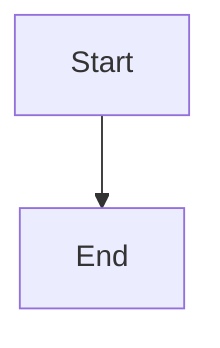

# Frequently Asked Questions

Common questions and answers about Retype.

## General Questions

+++ What is Retype?
Retype is an ultra-high-performance static site generator that builds a website based on simple Markdown (.md) text files. It allows you to focus on your writing while it automatically builds a beautiful, fast, and functional website.
+++

+++ Is Retype free to use?
Yes, Retype is free to use with both open-source and commercial projects up to 100 pages per project.

With [Retype Pro](https://retype.com/pro/), you get the following additional features:

1. No page limit
2. The `Powered by Retype` branding can be removed
3. Password protected private and protected pages
4. Outbound link configuration
5. Breadcrumb navigation
6. Hub link
7. Table of Contents configuration
+++

+++ What makes Retype different from other static site generators?
Retype focuses on:
- **Speed**: Ultra-fast build times and page loads
- **Simplicity**: Minimal configuration required
- **Rich features**: Built-in search, components, themes
- **Developer experience**: Live reload, easy deployment
+++

+++ Do I need to know programming to use Retype?
No! If you can write Markdown, you can use Retype. Basic knowledge of YAML for configuration is helpful but not required.
+++

## Installation & Setup

+++ What are the system requirements?
- Node.js version 14 or higher
- npm or yarn package manager
- Any text editor
+++

+++ How do I install Retype?
You can install Retype using `npm`, `yarn`, or the `dotnet` CLI:

+++ npm
```
npm install retypeapp --global
retype start
```
+++ yarn
```
yarn global add retypeapp
retype start
```
+++ dotnet
```
dotnet tool install retypeapp --global
retype start
```
+++

See the [Getting Started](/getting-started/) guide for detailed instructions.
+++

+++ Can I use Retype with an existing project?
Yes! Run `retype init` in your project directory to add Retype configuration to an existing project.
+++

+++ How do I upgrade to the latest version?
```bash
npm update retypeapp --global
```
+++

## Content & Writing

+++ What Markdown syntax does Retype support?
Retype supports GitHub Flavored Markdown (GFM) plus additional features like alerts, tabs, panels, and more. See the [Components Demo](/components-demo/) for examples.
+++

+++ Can I use HTML in my Markdown files?
Yes! You can mix HTML with Markdown for advanced formatting or embedding content.
+++

+++ How do I add images?
```markdown

```
You can also resize images:
```markdown
{ width="300" }
```
+++

+++ How do I organize my content?
Use folders to organize your content. Retype automatically generates navigation based on your folder structure and front matter configuration.
+++

+++ Can I control the order of pages in navigation?
Yes! Use the `order` property in front matter:
```yaml
---
order: 1000
---
```
Higher numbers appear first.
+++

## Configuration

+++ Where is the configuration file?
The main configuration file is `retype.yml` in your project root.
+++

+++ What can I configure?
- Branding (title, logo, colors)
- Navigation links
- Footer content
- Search settings
- Meta tags and SEO
- Analytics integrations

See the [Customization Guide](/guides/customization/) for details.
+++

+++ How do I add a custom logo?
Add this to your `retype.yml`:
```yaml
branding:
  logo: /static/logo.png
```
+++

+++ Can I use a custom domain?
Yes! Configure your hosting platform (GitHub Pages, Netlify, etc.) to use your custom domain. See the [Deployment Guide](/guides/deployment/).
+++

## Development

+++ How do I preview my site locally?
```bash
retype start
```
This starts a development server at `http://localhost:5000` with live reload.
+++

+++ Can I change the port for the development server?
Yes:
```bash
retype start --port 5001
```
+++

+++ How long does it take to build a site?
Retype is extremely fast. Most sites build in seconds, even with hundreds of pages.
+++

+++ Does Retype support hot reload?
Yes! When using `retype start`, changes to your files are automatically reflected in your browser.
+++

## Deployment

+++ How do I deploy my Retype site?
1. Build your site: `retype build`
2. Deploy the `.retype` folder to any static hosting service

Popular options:
- GitHub Pages
- Netlify
- Vercel
- Cloudflare Pages

See the [Deployment Guide](/guides/deployment/) for detailed instructions.
+++

+++ Can I deploy to GitHub Pages?
Yes! GitHub Pages is one of the easiest deployment options. See our [Deployment Guide](/guides/deployment/#github-pages) for setup instructions.
+++

+++ Is there a build process for deployment?
Yes, run `retype build` to generate static files in the `.retype` directory (or your configured output directory).
+++

+++ Can I use CI/CD for automatic deployments?
Yes! Retype works great with GitHub Actions, GitLab CI, and other CI/CD platforms. See [deployment examples](/guides/deployment/).
+++

## Features

+++ Does Retype have built-in search?
Yes! Retype includes powerful full-text search functionality that's automatically enabled.
+++

+++ Can I add analytics?
Yes! Retype supports:
- Google Analytics
- Google Tag Manager
- Plausible Analytics

Configure in `retype.yml`:
```yaml
integrations:
  googleAnalytics:
    id: G-XXXXXXXXXX
```
+++

+++ Does Retype support dark mode?
Yes! Dark mode is automatically supported and respects the user's system preference.
+++

+++ Can I use custom CSS?
Yes! Add custom CSS files and reference them in `retype.yml`:
```yaml
head:
  - <link rel="stylesheet" href="/static/custom.css" />
```
+++

+++ Does Retype support diagrams?
Yes! You can use Mermaid diagrams in your Markdown:
````markdown

````
+++

+++ Can I add code syntax highlighting?
Yes! Retype automatically highlights code blocks. Just specify the language:
````markdown
```javascript
console.log("Hello, World!");
```
````
+++

## Troubleshooting

+++ The build fails with errors
Common solutions:
- Check `retype.yml` syntax
- Ensure all referenced files exist
- Verify Node.js version (14+)
- Try `npm install retypeapp --global` again
+++

+++ My images aren't showing
Check:
- Image paths are correct (use `/` for root-relative paths)
- Image files exist in your project
- File extensions match (case-sensitive on some systems)
+++

+++ Navigation isn't showing my pages
Ensure:
- Files end with `.md`
- Front matter is properly formatted
- Pages aren't marked as `hidden: true`
+++

+++ Changes aren't reflecting in the browser
Try:
- Hard refresh (Ctrl+F5 or Cmd+Shift+R)
- Clear browser cache
- Restart `retype start`
+++

+++ How do I debug issues?
Run Retype with verbose output:
```bash
retype build --verbose
```
+++

## Performance

+++ How fast is Retype?
Retype is designed for speed:
- Fast build times (seconds for most sites)
- Optimized page loads
- Minimal JavaScript
- Efficient search indexing
+++

+++ Can Retype handle large sites?
Yes! Retype efficiently handles sites with hundreds or thousands of pages.
+++

+++ Does Retype optimize images?
Retype doesn't automatically optimize images, but you can add image optimization to your build pipeline or use pre-optimized images.
+++

## Support & Community

+++ Where can I get help?
- [Official Documentation](https://retype.com)
- [GitHub Discussions](https://github.com/retypeapp/retype/discussions)
- [GitHub Issues](https://github.com/retypeapp/retype/issues)
+++

+++ How do I report a bug?
Open an issue on the [GitHub repository](https://github.com/retypeapp/retype/issues) with:
- Retype version
- Steps to reproduce
- Expected vs actual behavior
- Error messages (if any)
+++

+++ Can I contribute to Retype?
Yes! Contributions are welcome. Check the [GitHub repository](https://github.com/retypeapp/retype) for contribution guidelines.
+++

+++ Is there a roadmap?
Check the [GitHub repository](https://github.com/retypeapp/retype) for planned features and upcoming releases.
+++

## Advanced Usage

+++ Can I use Retype for a blog?
Yes! Retype is great for blogs. Use folders to organize posts and front matter for dates and metadata.
+++

+++ Does Retype support multiple languages?
Retype supports UTF-8 content in any language. For multi-language sites, organize content in separate folders (e.g., `/en/`, `/es/`).
+++

+++ Can I create custom components?
You can use HTML and custom CSS to create custom components. For more advanced customization, you can extend Retype's functionality.
+++

+++ How do I create a landing page?
Use the `README.md` in your root directory as your landing page. Customize it with front matter and content.
+++

+++ Can I password-protect my site?
Retype generates static files, so password protection must be implemented at the hosting level (e.g., using Netlify's password protection feature).
+++

## Licensing

+++ What license does Retype use?
Check the [official Retype repository](https://github.com/retypeapp/retype) for licensing information.
+++

+++ Can I use Retype for commercial projects?
Yes! Retype can be used for commercial documentation and websites.
+++

---

## Still have questions?

- Browse the [Getting Started](/getting-started/) guide
- Check the [Components Demo](/components-demo/)
- Read the [Guides](/guides/)
- Visit the [official documentation](https://retype.com)
- Ask in [GitHub Discussions](https://github.com/retypeapp/retype/discussions)
